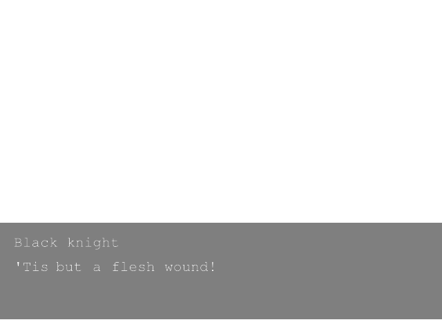
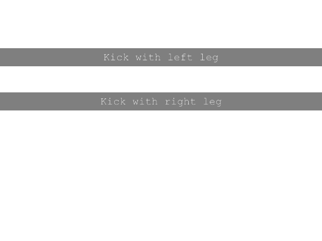

# Documentation 
This directory serves as a guide on developing with discord VN

# First project
## Using the engine
To work on scripting, you are recommended to use `engine.exe` in `engine.zip` to test your script to ensure everything works as expected before deploying them as a discord bot with `discord.exe` in `discord.zip`.

## Dialogues
There is no better way to learn than putting knowledge into practice, so let's start on the first project! 💻

The most important element of any visual novel is the dialogue.
Let's begin writing writing our first dialogue ⚡

```ini
[Black knight]
'Tis but a flesh wound!
```

Now to render it ✨ If you don't have `engine.exe` and its files yet, go get them [here](https://github.com/grostaco/discord_vn/releases/tag/latest). Once you have them ready your directory should look something like
```
.
├── engine.exe
├── resources
│   ├── config.conf
│   ├── render
│   └── script.txt
└── run_engine.bat
```
If you are using linux or macos, see the installation guide on README.md

Your `script.txt` should look like
```ini
[Black knight]
'Tis but a flesh wound!
```

Once everything is set up, double click on `run_engine.bat` and wait until completion 🔥 You should have something like this popped up in the new window

```
[*] Discord VN scripting engine
[*] ver 1.0.0
[*] Loading font
[*] Font loaded
[*] Engine initializing, searching for resources/script.txt
[*] Engine initialized. Rendering...
[!] It should be noted that if there are conditional jumps in the script, you will be prompted.
[*] Rendering dialogue: "'Tis but a flesh wound!"
```
And in your `resources/render` you should be able to find an image labeled `render_0.png`



This is great 🪁 Our script ran with 0 issues!

## Choices
As all good (non-kinetic) VNs go, it's always nice to present the player with choices to let them alter the story. So without further ado, let's do exactly just that!

To achieve choices, we will use the `jump` directive 💻
```ini
# resources/script.txt
[Black knight]
'Tis but a flesh wound!

@jump(Kick with left leg,Kick with right leg,resources/kicked_left.txt)
@jump(resources/kicked_right.txt)
```

```ini
# resources/kicked_left.txt
[]
You kicked the assailant with your left leg!
```

```ini
# resources/kicked_right.txt
[]
You kicked the assailant with your right leg!
```

Woah, what happened? We suddenly started using a new `@` thing and created a bunch of new files! 
First thing first, let's look at the `jump` directive.

| Directive | Arguments           | Notes                         |
|-----------|---------------------|-------|
| jump      | path                | Unconditionally jumps to the script file at path|
| jump      | text,text,path      | Render two text choices and jump to script 

`@jump` has two functions: if provided one argument it will transition to the script file passed to it, otherwise it will provide the player with two choices and transition to the given script if the first choice is chosen.

Sounds complicated? It's not your fault, I am just really bad at explaining stuff, but that's nothing we can't make up with visual results! Come revisit this part once you see the end result.

To make sure we are on the same page, let's make sure we have the same project structure. Your files should look something like this

```
.
├── engine.exe
├── resources
│   ├── config.conf
│   ├── kicked_left.txt
│   ├── kicked_right.txt
│   ├── render
│   └── script.txt
└── run_engine.bat
```

Once you are ready, double click on `run_engine.bat` and you should see the program stuck asking you for a prompt

```
[*] Discord VN scripting engine
[*] ver 1.0.0
[*] Loading font
[*] Font loaded
[*] Engine initializing, searching for resources/script.txt
[*] Engine initialized. Rendering...
[!] It should be noted that if there are conditional jumps in the script, you will be prompted.
[*] Rendering dialogue: "'Tis but a flesh wound!"
[?] A conditional choice was found, choose 1 or 2.
 ├──[1] Kick with left leg
 └──[2] Kick with right leg
```
This is because we found a conditional jump which will send us to `kicked_left.txt` if option 1 was selected, else we will stay on this script.

On the discord's bot point of view or rendering you will see


From here, try experimenting with the jump system until you got it! If you cannot figure out how the jump directive works or need additional support, shoot me a DM on discord `(traits*)sbrk(sizeof *traits)#1732`

## Loading background
WIP

## Loading sprites
WIP

## Play music

## Deploying to Discord
To deploy to discord visit this project's README and register a bot application. Once you have, download `discord.zip` and fill `config.conf` with the guild id, the application id, and the token of your bot. Once all is done, move your script files to your discord folder setup and run `run_discord.bat` and voila!